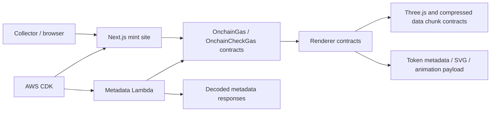

# OnChainGas

Historical onchain NFT experiment that explored whether a token could package a browser-rendered gas-price visualizer through Solidity metadata, renderer contracts, compressed data chunks, and a small minting site.

This was built quickly and remains useful as an experiment in onchain media, Solidity renderers, and NFT metadata plumbing. It should not be read as an active product.

## Question Explored

What does it take to put a dynamic, inspectable gas-price visualization as close to onchain as practical, including the rendering payload and token metadata, while still making it viewable through normal NFT and web surfaces?

## How It Works

- Solidity contracts define the NFT, metadata URI interface, renderer contracts, base64 helpers, compiler/data-chunk helpers, and gas-visualization libraries.
- Large JavaScript/Three.js payloads are split into `ThreeDataChunk*` and `FFlateDataChunk*` contracts and reassembled by renderer/compiler contracts.
- The mint website uses Next.js, React, ethers/wagmi, and Three.js to present the mint and visualizer UI.
- A metadata Lambda can read token metadata from the contract and return decoded metadata, SVG, or iframe-style content.
- AWS CDK deployment code wires static site hosting, Lambda metadata routes, CloudFront/API Gateway behavior, and supporting assets.

## Architecture

## Repository Map

- `contract/` - Hardhat project, Solidity contracts, deployments, tests, and renderer/data chunk code.
- `www/` - original Next.js mint website and visualizer UI.
- `www-next/` - later Next.js app work that also contains Fame-related routes.
- `metadata/` - Lambda for reading and decoding onchain metadata.
- `deploy/` - AWS CDK deployment for website and metadata infrastructure.

## Public Contract and Network Notes

The code includes mainnet/testnet deployment scripts and Hardhat network config. Public contract addresses and deployment artifacts are part of the repository history where checked in. Private RPC URLs, deployer keys, and explorer keys are expected through environment variables and are not included.

The repository homepage currently points to the original public deployment: [onchaingas.vercel.app](https://onchaingas.vercel.app).

## Current Status

This is a historical experiment. The original mint/deployment may be inactive or stale, and the README does not claim an active mint, maintained frontend, or current network support. Review contract deployment files, current chain state, and website behavior before interacting with it.

## Known Limits

- Dynamic behavior depends on external RPC reads from the renderer or helper surfaces.
- Browser and marketplace support for rich metadata/iframe-style payloads varies.
- Deployment scripts target older versions of Hardhat, Next.js, AWS CDK, and related libraries.
- No current benchmark, audit, or active-maintenance claim is made here.

## Development Pointers

- [Contracts](contract/README.md)
- [Mint website](www/README.md)
- [Metadata Lambda](metadata/README.md)
- [AWS deployment](deploy/README.md)
